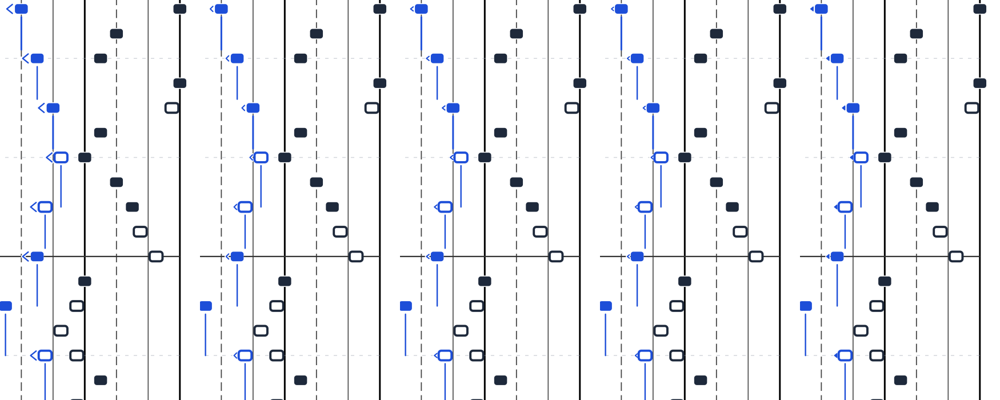
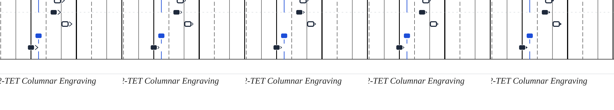

# Aesthetic Tuning: Handedness Indicators

This study evaluates the geometry and proportions of the `<` and `>` handedness indicators across different roof pitches (opening angles), arm lengths, clearances, and forms.

## Comparative Overview

### Measure 30 (Dense Successive LH Eighth-Note Run)

*(From left to right: Current $\to$ Option 1 $\to$ Option 2 $\to$ Option 3 $\to$ Option 4)*

### Measure 4 (RH Crossing Notes with `>` Indicator)

*(From left to right: Current $\to$ Option 1 $\to$ Option 2 $\to$ Option 3 $\to$ Option 4)*

---

## Parameter Variations

| Variation | Pitch (Angle) | Height ($h$) | Width ($w$) | Clearance | Stroke | Character |
| :--- | :--- | :--- | :--- | :--- | :--- | :--- |
| **Current** | $60^\circ$ (steep) | $5.2\text{pt}$ | $3.2\text{pt}$ | $1.5\text{pt}$ | $0.8\text{pt}$ | Tall, overhanging roof eaves spanning the entire notehead height ($5.6\text{pt}$). |
| **Option 1 (Compact 90°)** | $90^\circ$ (balanced) | $3.0\text{pt}$ | $1.5\text{pt}$ | $1.2\text{pt}$ | $0.7\text{pt}$ | Proportional right-angle chevron; arms stay within central 50% of notehead. |
| **Option 2 (Flatter Pitch 100°)** *(Recommended)* | $100^\circ$ (flatter) | $2.4\text{pt}$ | $1.5\text{pt}$ | $1.0\text{pt}$ | $0.7\text{pt}$ | Sleek, modern arrow feel. Flat roof pitch eliminates all eave overhang. |
| **Option 3 (Delicate)** | $105^\circ$ | $2.0\text{pt}$ | $1.2\text{pt}$ | $0.8\text{pt}$ | $0.65\text{pt}$ | Minimalist punctuation mark; subtle and unobtrusive. |
| **Option 4 (Filled Wedge)** | $100^\circ$ | $2.4\text{pt}$ | $1.5\text{pt}$ | $1.0\text{pt}$ | Solid fill | Geometric arrowhead / pip; clean contrast without hollow arms. |
