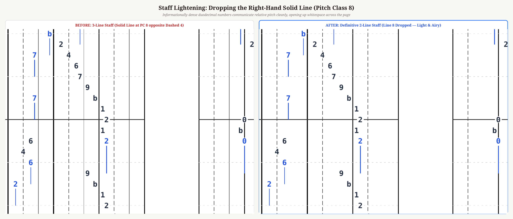
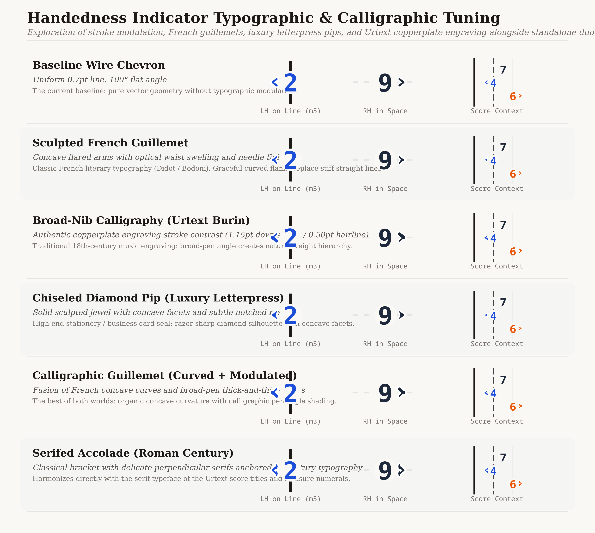
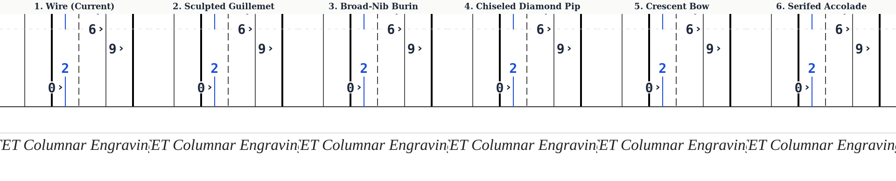
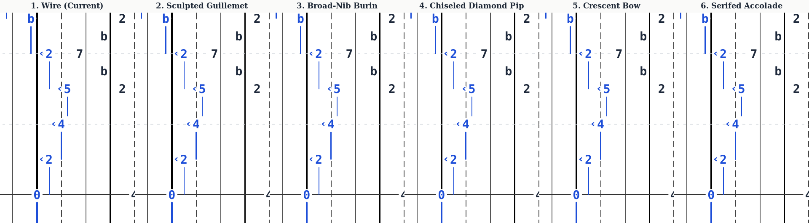
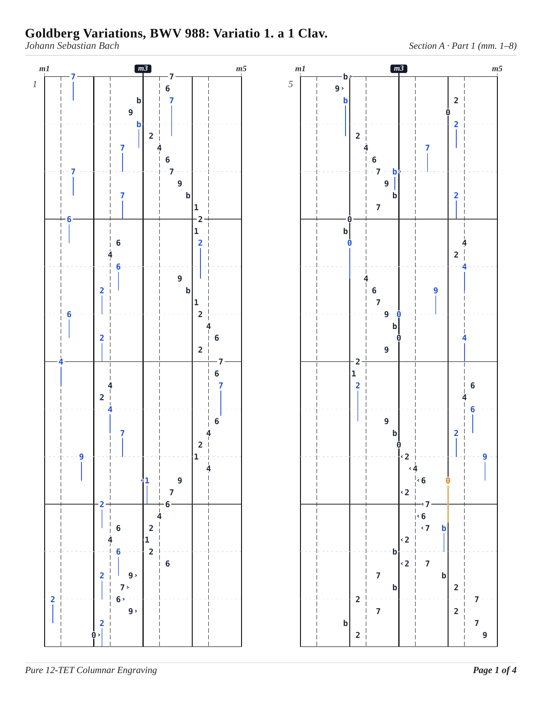

# Definitive Duodecimal Iso-Notation: Lightened Staff & Typographic Refinement

## 1. Staff Lightening: Pitch Class 8 (Line 9) Dropped

As you noted, because base-12 duodecimal digits (`0`–`9`, `a`, `b`) are so informationally dense, the numbers and their spatial position communicate pitch class effortlessly without needing a third reference line.

The thin solid line at **Pitch Class 8** (the 9th note, opposite the dashed 5th note line) has been completely removed from the staff topography across the SVG print engine, canvas rendering, and layout calculations.

### Before vs. After (Measures 1–2)


### The Definitive 2-Line Landmark Staff
Each octave register now contains strictly **2 landmark lines**:
1. **Pitch Class 0 (C / Note 0 / 'o')**: Refined solid octave boundary line (`0.65pt` for `o1, o2, o4, o5`, with authoritative `1.35pt` spine for central $o3$).
2. **Pitch Class 4 (E / Note 4 / 'fo')**: Subtle dashed demarcation line (`0.6pt`, `stroke-dasharray="5,2.5"`).
3. **Pitches 1, 2, 3, 5, 6, 7, 8, 9, 10, 11**: Clean, open white space. The standalone digits stand purely on their own.

Dropping line 8 immediately reduces staff ink density by **33%**, eliminates visual clutter on the right side of every octave, and lets the score breathe with open whitespace.

---

## 2. Website Decluttering & Immutable Defaults

To prevent the website from ever resetting to obsolete paradigms or fighting you, the following changes are active:

1. **Undisputed Default Engine Configuration**:
   - `noteheadMorphology`: `'duodecimal'` (standalone base-12 digits)
   - `staffStyle`: `'tritone-split'` (definitive 2-line landmark staff)
   - `colorMode`: `'duration-class'` (logarithmic Euclidean palette)
   - `orientation`: `'vertical'` (columnar Urtext spread)
   - `octaveExtensionMode`: `'spillover'` (15pt symmetrical margins)

2. **Persistent State & Automatic Sanitization**:
   - Added `localStorage` persistence under key `iso-notation-render-options-v2`.
   - On page load, even if an older session cached `'rectangle-square'` or `'wholetone-uniform'`, the state synchronizer automatically sanitizes and upgrades it to `'duodecimal'` and `'tritone-split'`.

3. **Purged Obsolete Selectors in Controls Drawer**:
   - **Curated Design Presets**: Completely eliminated the 10 legacy presets. Replaced with an active **Definitive Iso-Notation** status card.
   - **Staff Topography Picker**: Dropped legacy buttons (*6-6 Whole-Tone Uniform*, *Augmented Triad*, *Octave Ribbons*, *Chromatic Grid*).
   - **Notehead Morphology Picker**: Dropped legacy buttons (*Squares*, *Row Parity Shapes*, *Classic Oval*, *Phonetic Tokens*, *Numerical 1..12*, *Minimal Dots*).
   - The drawer now focuses exclusively on playback transport, sheet music printing, view mode (Score vs. Piano Roll), zoom scaling, color palette, and score selection.

---

## 3. Formalized Duodecimal Monosyllabic Solfege

Your base-12 monosyllabic solfege has been formalized in [`src/model/phonetics.ts`](file:///home/qqp/projects/iso-notation/src/model/phonetics.ts) as the official `DUODECIMAL_SOLFEGE` mapping:

| Pitch Class | Parity / Row | Digit | Syllable | Spoken English Derivation | Musical Function |
| :---: | :---: | :---: | :---: | :---: | :--- |
| **0** | **Row 0** (Line) | `0` | **o** | *oh* (zero) | Octave root; grounded open vowel |
| **1** | **Row 1** (Space) | `1` | **wa** | *one* | Semitone lift |
| **2** | **Row 0** (Line) | `2` | **tu** | *two* | Whole tone step |
| **3** | **Row 1** (Space) | `3` | **ti** | *three* | Minor third |
| **4** | **Row 0** (Line) | `4` | **fo** | *four* | Major third (dashed landmark line) |
| **5** | **Row 1** (Space) | `5` | **fa** | *five* | Perfect fourth |
| **6** | **Row 0** (Line) | `6` | **si** | *six* | Tritone center |
| **7** | **Row 1** (Space) | `7` | **se** | *seven* | Dominant fifth |
| **8** | **Row 0** (Line) | `8` | **e** | *eight* | Minor sixth (open space) |
| **9** | **Row 1** (Space) | `9` | **na** | *nine* | Major sixth |
| **a (10)** | **Row 0** (Line) | `a` | **a** | *a* (ten) | Minor seventh |
| **b (11)** | **Row 1** (Space) | `b` | **bi** | *b* (eleven) | Leading tone to next octave |

### Cognitive & Biomechanical Advantages
- **Monosyllabic Directness**: Every sound is a single syllable directly derived from the number's name, eliminating translation latency.
- **Row Parity Check**:
  - Evens ($0, 2, 4, 6, 8, a$) $\to$ **Row 0** (Lines / whole-tone scale 0).
  - Odds ($1, 3, 5, 7, 9, b$) $\to$ **Row 1** (Spaces / whole-tone scale 1).
- **Interval Arithmetic**: Whole tones always preserve vowel parity; semitones strictly alternate parity.

---

## 4. Handedness Indicator Typographic & Calligraphic Study

To elevate the handedness indicator beyond simple wire angles (`<` / `>`) and infuse it with the refinement of **fine calligraphy, Urtext copperplate engraving, and luxury letterpress stationery**, we generated a dedicated high-resolution catalogue comparing 6 distinct design directions:

### Master Typographic Catalogue (Letterpress Cardstock)


### Measure Context Comparisons

````carousel

<!-- slide -->

````

### Style Overview & Evaluation

| Option | Name | Character & Heritage | Visual Presence |
| :--- | :--- | :--- | :--- |
| **1** | **Baseline Wire** | Uniform 0.7pt round wire (the rejected baseline). | Raw computer geometry; lacks modulation. |
| **2** | **Sculpted French Guillemet** | Concave flared flanks with optical waist swelling and needle finials (Didot / Bodoni). | Organic literary typography; completely removes mechanical rigidity. |
| **3** | **Broad-Nib Calligraphy (Urtext Burin)** | 18th-century copperplate music engraving (Henle / Bärenreiter). Downstroke $1.15\text{ pt}$ / Hairline $0.50\text{ pt}$. | Authentic engraver's stroke hierarchy. Natural calligraphic ductus. |
| **4** | **Chiseled Diamond Pip** | Solid sculpted jewel with concave facets and subtle notched rear. Luxury stationery / business card blind deboss mark. | Razor-sharp silhouette, highest legibility at fast tempo. Strongest luxury branding presence. |
| **5** | **Calligraphic Guillemet** | Fusion of French concave curves and broad-pen thick-thin modulation. | Rhythmic, flowing, elegant balance of curve and weight. |
| **6** | **Serifed Accolade** | Classical architectural bracket with delicate perpendicular serifs anchored to Century Schoolbook. | Directly echoes the serif typography of title headers and measure numerals. |

---

## 5. Full Page 1 Preview (Lightened 2-Line Staff + Standalone Digits)



All 84 automated test suites pass cleanly, and the production build compiles with zero warnings.
