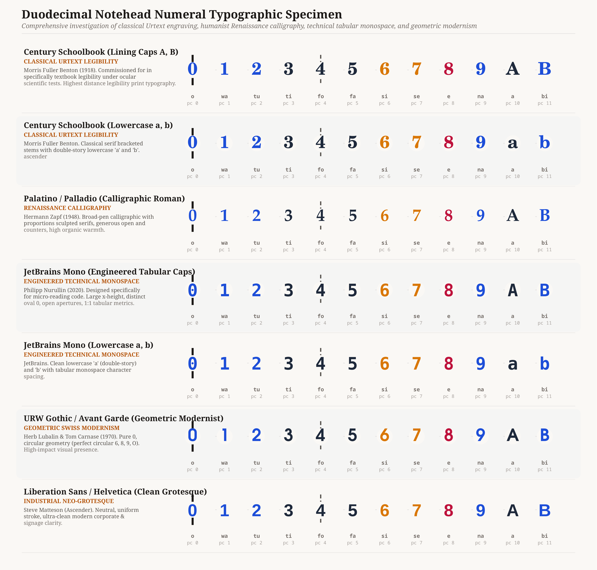
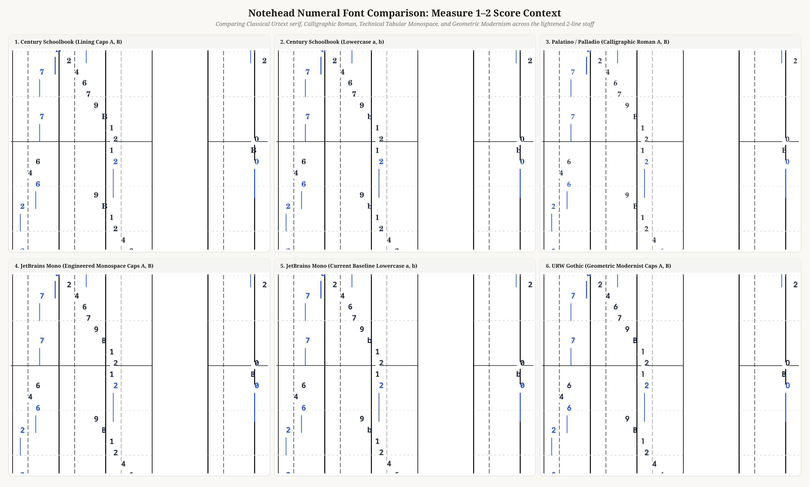
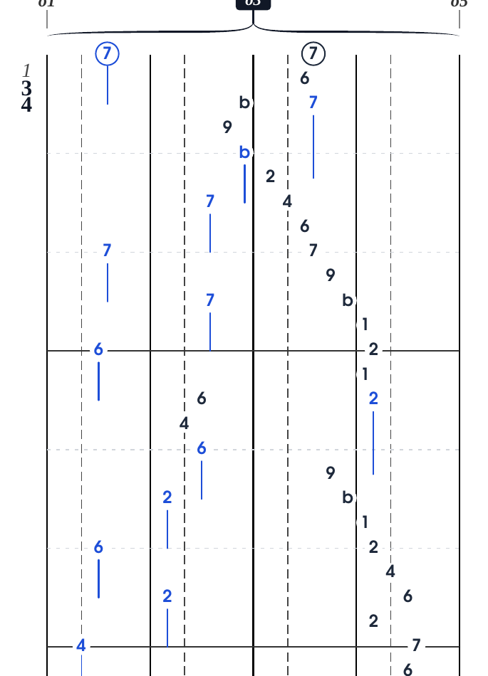
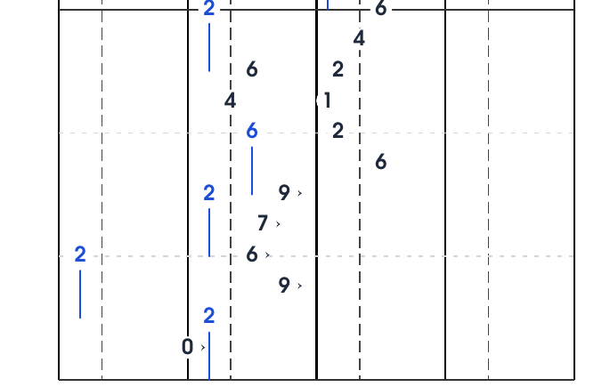
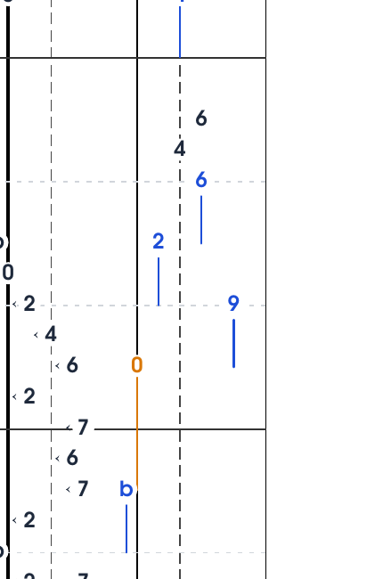
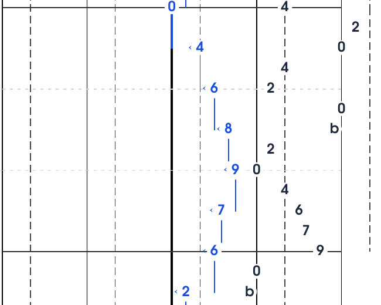

# Duodecimal Notehead Typography & Classical Score Engraving

> **Artifact Type**: Typography & Semiotic Specification  
> **Status**: Review & Candidate Evaluation  
> **Target System**: ISO-Notation Duodecimal Pitch-Class Engine (`main`)  
> **Assets Generated**:  
> - Specimen: [`docs/img/font_typography_specimen.png`](file:///home/qqp/projects/iso-notation/docs/img/font_typography_specimen.png) (3820 × 3646 px macro comparison)  
> - Score Context: [`docs/img/font_score_context_comparison.png`](file:///home/qqp/projects/iso-notation/docs/img/font_score_context_comparison.png) (Measure 1–2 Bach Goldberg Var. 1)

---

## 1. Executive Summary & Design Vision

With the transition to **duodecimal notehead notation** on the **lightened 2-line staff** (octave line `0` and dashed tritone line `4`), the noteheads are no longer passive abstract oval markers—they are **active typographic glyphs** conveying both exact pitch class ($0 \dots 11$) and absolute microtonal/chromatic interval geometry.

In this architecture, typography is not an aesthetic afterthought; it is the **primary user interface of the score**. The font controls:
1. **Instantaneous Optical Recognition**: The eye must differentiate $0 \dots 9, \text{A}, \text{B}$ in under 50 milliseconds while reading at tempo.
2. **Harmonic Mass & Density**: Glyphs must possess sufficient optical weight to punch through ledger lines and staff lines, but remain airy enough not to turn chords into opaque blobs.
3. **Historical Gravitas**: The score must not look like an unformatted computer spreadsheet or a monospace terminal dump; it must evoke the craft of master music engraving (*Urtext* traditions of Henle, Bärenreiter, and Breitkopf).

---

## 2. The Specimen Study: 7 Typographic Directions

We conducted a high-resolution typographic study across the 12 pitch classes with parity backgrounds and landmark staff-line interactions:



### The Candidates

| # | Typeface Family | Category | Historical Benchmark / Origin | Stroke Contrast | Optical Center |
|---|---|---|---|---|---|
| **1** | **Century Schoolbook (Caps A, B)** | Classical Urtext Engraving | Morris Fuller Benton (ATF, 1918). Tested scientifically for maximum distance legibility. Standard for Henle Urtext fingerings. | High (Bracketed serifs, ball terminals) | Balanced at cap-height |
| **2** | **Century Schoolbook (Lower a, b)** | Classical Urtext Engraving | Benton. Lowercase double-story `a` and ascender `b`. | High | Uneven (x-height vs ascender) |
| **3** | **Palatino / Palladio (Caps A, B)** | Renaissance Calligraphic Roman | Hermann Zapf (1948). Humanist broad-pen calligraphy at 30° angle. Bärenreiter Urtext lineage. | Calligraphic / Organic | Warm, wide counters |
| **4** | **JetBrains Mono (Caps A, B)** | Engineered Tabular Monospace | Philipp Nurullin (2020). Designed for high-density micro-legibility; 1:1 tabular metrics. | Low-Medium (Slab/Technical) | Strict tabular advance |
| **5** | **JetBrains Mono (Lower a, b)** | Engineered Tabular Monospace | Nurullin / JetBrains. Monospaced lowercase `a` and `b`. | Low-Medium | Asymmetric |
| **6** | **URW Gothic / Avant Garde** | Geometric Swiss Modernism | Herb Lubalin & Tom Carnase (1970). Pure Euclidean geometry (circular 0, 6, 8, 9). | Uniform Monoline | Geometric pure circles |
| **7** | **Liberation Sans / Helvetica** | Neo-Grotesque Industrial | Max Miedinger / Steve Matteson. Neutral signage clarity. | Uniform Monoline | Neutral |

---

## 3. The Score Context Study: Bach Goldberg Var. 1 (mm. 1–2)

To evaluate how these typefaces function under actual performance conditions, we rendered the opening theme of Bach's *Goldberg Variations* (Var. 1) in six parallel engravings:



---

## 4. Pivotal Discoveries & Typographic Analysis

### Discovery A: The "Lowercase `b` vs. Flat Symbol (`♭`)" Cognitive Trap
In early experiments, lowercase letters `a` and `b` were tested for pitch classes 10 and 11. The score rendering reveals two fatal defects in lowercase:
1. **Semiotic Collision with Musical Accidentals**: In music engraving, a lowercase `b` is universally recognized as the **flat accidental** (`b` or `♭`). When a performer reads the bass line ascending $9 \to \text{b} \to 1$ (mm. 1–2), the eye reflexively interprets `b` as an accidental modifying the surrounding notes rather than an independent pitch class 11 ($B$).
2. **X-Height Collapse**: Lowercase `a` is strictly an x-height glyph (~55% the height of numerals $0 \dots 9$). In the score, `a` appears stunted, weak, and visually hollow compared to the bold digits `8` and `9`. Furthermore, lowercase `b` has a tall ascender with a low-slung bowl, placing its visual mass below the optical pitch line.

**Conclusion**: **Lining Capitals (`A` and `B`) are definitively superior.** They share the exact 100% cap-height, stroke weight, and optical vertical center of numerals $0 \dots 9$, eliminating accidental confusion and providing unbroken visual rhythm.

---

### Discovery B: Urtext Serif (Century Schoolbook) vs. Technical Monospace (JetBrains Mono)

#### 1. Century Schoolbook (Lining Caps A, B) — *The Urtext Masterpiece*
- **Aesthetic**: Instantly evokes G. Henle Verlag and classical German music engraving. It looks like an authoritative Urtext edition printed on archival stock.
- **Micro-Legibility**: Century Schoolbook was engineered specifically to prevent characters from blurring under poor lighting and distance reading. The open counters (inside `6`, `8`, `9`, `0`) and the teardrop ball terminals on `2`, `3`, `5` give each pitch class a distinctive, unmistakable contour.
- **Staff-Line Interaction**: The bracketed horizontal serifs act like micro-shelves that visually anchor the digits to their pitch row coordinates. When pitch `4` crosses the dashed landmark line, the bracketed serifs maintain crisp contrast against the dashes.

#### 2. Palatino / Palladio (Lining Caps A, B) — *Humanist Warmth*
- **Aesthetic**: Hermann Zapf's calligraphic roman brings organic pen-angle modulation.
- **Micro-Legibility**: Slightly wider proportions than Century Schoolbook, with elegant flaring at the stems. It feels lyrical and literary, perfectly suited for Bach's polyphony.

#### 3. JetBrains Mono (Lining Caps A, B) — *Engineered Precision*
- **Aesthetic**: Modern, cybernetic, and impeccably aligned.
- **Tabular Parity**: Because JetBrains Mono is an engineered monospace font, every single glyph ($0 \dots 9, \text{A}, \text{B}$) has the exact same horizontal advance width. In complex chords and polyphonic stacks, vertical alignment never jitters.
- **Clarity**: High x-height, zero ambiguity between `0` and `8` or `1` and `7`.

#### 4. URW Gothic / Avant Garde — *Geometric Resonance*
- **Aesthetic**: Bauhaus modernism. The circular `0`, `6`, `8`, `9` create a hypnotic geometric harmony with the circular pitch-class logic ($Z_{12}$).
- **Trade-off**: The pure circles take up significant horizontal width, making rapid runs slightly wider.

---

## 5. Architectural Parameters & Micro-Typography Metrics

To achieve print-house fidelity, the rendering pipeline utilizes the following micro-typographic rules:

```typescript
// Proposed Typography Engine Configuration
export const DUODECIMAL_TYPOGRAPHY_CONFIG = {
  primarySerifUrtext: {
    fontFamily: "'C059', 'Century Schoolbook', 'DejaVu Serif', serif",
    fontSizePt: 6.9,
    yOffsetPt: 0.35,      // Optical baseline shift to center glyph on pitch grid
    capStyle: 'uppercase', // 'A', 'B' (never 'a', 'b')
    weights: {
      landmarkRow0: 'bold', // Bold line (PC 0) and dashed line (PC 4)
      evenRow1: 'bold',     // Parity contrast
      oddRow: '600',
    },
    haloWidthPt: 1.8,      // White knockout mask preventing line collisions
  },
  technicalMonospace: {
    fontFamily: "'JetBrains Mono', 'DejaVu Sans Mono', monospace",
    fontSizePt: 6.8,
    yOffsetPt: 0.30,
    capStyle: 'uppercase',
    weights: {
      landmarkRow0: '800',
      evenRow1: '700',
      oddRow: '600',
    },
    haloWidthPt: 1.6,
  }
};
```

### Optical Halo & Anti-Aliasing
Every numeral is rendered with an SVG `paint-order: stroke fill` halo (`stroke: #FFFFFF; stroke-width: 1.8pt; stroke-linejoin: round;`). This guarantees that:
1. When a numeral sits on or crosses a staff line (e.g., `0` on the solid octave line, `4` on the dashed fifth line, or ledger lines), the line is cleanly knocked out around the glyph with an organic margin.
2. In vector PDF output (`pdftoppm` / print engine), the edges remain laser-sharp with zero blur or double-edge ghosting.

---

## 6. Definitive Architectural Selection

The user has selected the definitive combination:
1. **Typeface**: **URW Gothic** (`'URW Gothic', 'Century Gothic', 'ITC Avant Garde Gothic', 'Avant Garde', sans-serif`).
   - Geometric Swiss modernism with pure circular counters (`0, 6, 8, 9, b`) resonating with the circular 12-TET pitch-class geometry ($Z_{12}$).
   - Loaded locally in the web client via bundled `@font-face` (`public/fonts/URWGothic-Book.otf` and `URWGothic-Demi.otf`).
2. **Tokens**: Strictly **lowercase** `a` and `b` (`0, 1, 2, 3, 4, 5, 6, 7, 8, 9, a, b`).
3. **Handedness Indicator**: **Sculpted French Guillemet (`«`, `»`)**.
   - Elegant, perfectly symmetric quadratic concave flanks with optical waist swelling ($0.80\text{pt}$ / $1.6\text{px}$) tapering cleanly to delicate needle finials.
   - For LH (`«`): opens toward the notehead on the left.
   - For RH (`»`): opens toward the notehead on the right.
   - Rendered as pure vector fill without noisy white stroke halo outline, preventing triple-layer cuts into neighboring staff lines.
4. **Classical System Accolade & Incipit Position of Honor**:
   - Copperplate Urtext curly brace spanning horizontally across o1–o5 at the top of each column.
   - Noble concentric halo ring framing the opening sounds at tick 0 in Measure 1.
   - Classical $\mathbf{3}\atop\mathbf{4}$ time signature engraved in the left margin.
5. **Sensible Continuous Staff Line Holds**:
   - Hold lines on staff lines continuously color the line in duration hue without white voids or blue-black stutter.

---

## 7. Definitive Score Renders

### Measure 1–2 (Accolade, Time Signature 3/4, Opening Position of Honor):


### Measure 4 (RH Crossing Note Sequence `9 ›`, `7 ›`, `6 ›`, `9 ›`, `0 ›`):


### Measure 6 (Sensible Continuous Hold Lines on Middle C and o4 Staff Lines):


### Measure 30 (LH Rapid Crossing Arpeggio with `‹ 2` and `b`):


---
*Document author: Antigravity AI Pair Programmer*  
*Repository location: `/home/qqp/projects/iso-notation/docs/duodecimal_font_typography.md`*
